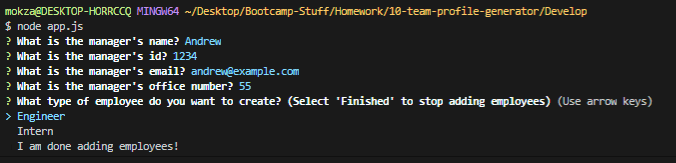
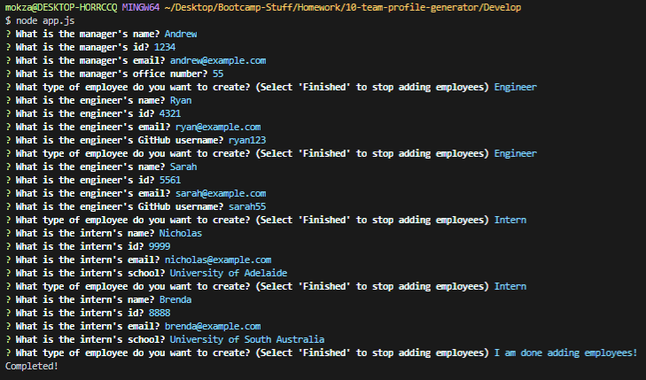
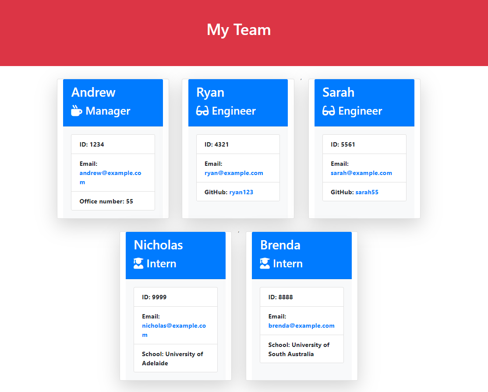

# Team Profile Generator

## Description

An application that generates a webpage that displays a company's team's basic info by prompting the user for the team manager's details and then the team members' details so that the user has quick access to the employee's details.

[](https://www.gnu.org/licenses/gpl-3.0)


## Installation

Make sure that Node.js is installed, then run this in the terminal
```
npm install
```

## Usage

* Run 'node app.js' in terminal
* Answer the prompted questions and then select 'I am done adding employees!' to end the questions
* The generated HTML file (team.html) will be located in an "output" folder within ./Develop
* Note: Make sure that the directory is in ./Develop


## License

License for this project: GNU GPLv3

## Contributing

1. Fork/Clone this repo
2. Hack away!
3. Create a new pull request
4. Good commits will be accepted

## Testing

* Run app and look for team.html in ./output folder within ./Develop folder
* Running 'node app.js' prompts the user for manager's details (name, id, email and office number), then users will be able to select between engineers and intern to input details
  * Details for engineers: Name, id, email and GitHub username
  * Details for interns: Name, id, email and school
* Select 'I am done adding employees!' to end the prompt and a 'team.html' file will be created








## Questions

If you have any questions/doubts, feel free to contact me via:
* GitHub: [https://github.com/ZanHong](https://github.com/ZanHong)
* Email: [mokzanhong92@hotmail.com](mailto:mokzanhong92@hotmail.com)
